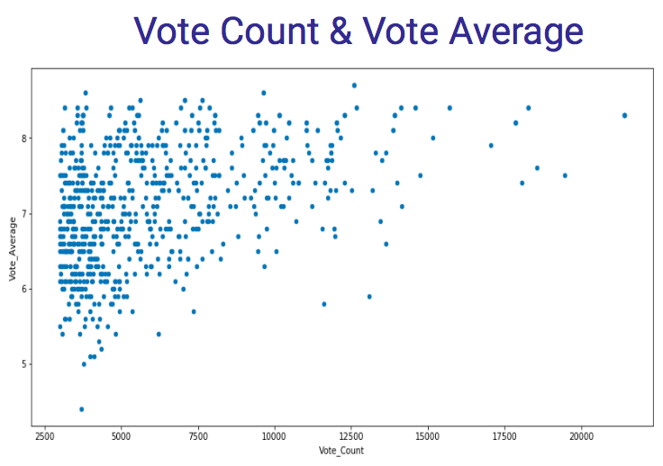
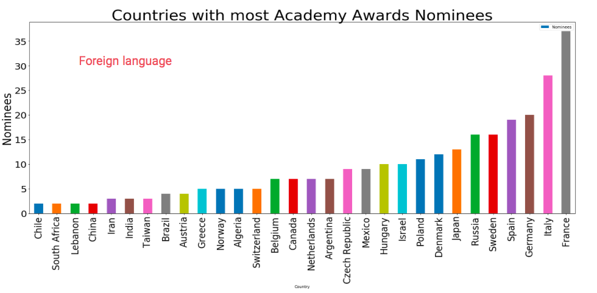
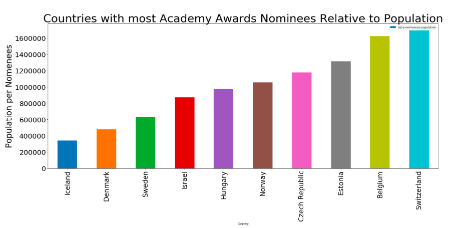

# The-Movie-Data-Base
## Using API and Web Scraping with the Movie Data Base

Project Contributors: Mohamad Eldebek and Omer Hakim

## Goals:
The goals of this small project were to find data and new insights about movies that can give new ideas regarding possible investments in the industry.

## Method of Work:
The first phase was cultivating data from “The Movie Data Base” - www.themoviedb.org . We used API key to collect the data, and we sorted out information regarding votes count and votes averages. We were looking for correlations between the two. We used sqlite3 (SQL)  to sort and store the data. Later we used pandas to grouping and visualization.

## Insights:

Correlation between votes count and votes average is not significant - 0.28   (only movies with more than 3000 counts were been researched)

On the other hand, and kind of expected, correlation between year of release and vote count is significant = 0.844 . 

This is a correlation for the sum of votes grouped by year. It shows that more movies has been voted for and more counts were given for each movie in recent years. 

Interesting connection can be found between the vote average and year release. almost only films with high vote average continue to recive count  many years after their release.
The conclusion is probably, the for a film to succeed,in the first few years marketing and buzz may work, but for consistency over many years good quality is a necessity.

 ------
The second phase was scraping data from Wikipedia about the nominees for the academy award for foreign language film (from 1956 onward). We used BuetifulSoup for the scraping, and stored the data in pandas data frame. Later we imported csv file from the the UN website (with information regarding the world population) and merged it with our scraped pandas Data frame. Based on this data we were looking for interesting opportunities of investment in the film industry abroad.

