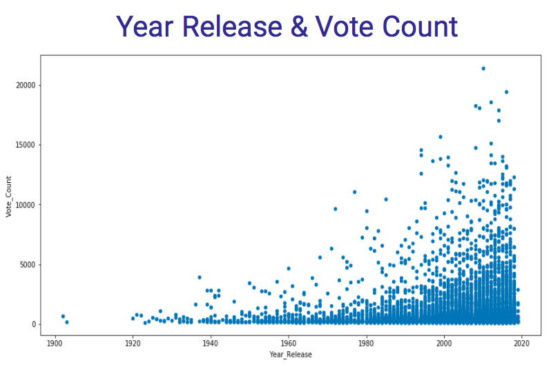
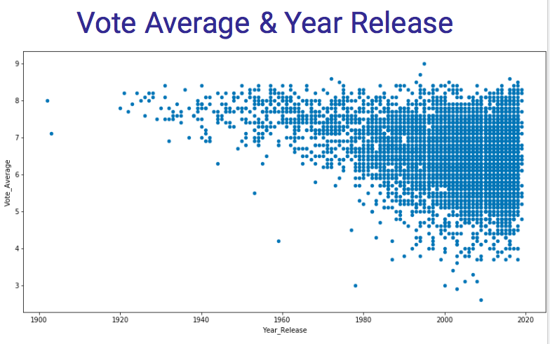

# The-Movie-Data-Base
## Using API and Web Scraping with the Movie Data Base

Project Contributors: Mohamad Eldebek and Omer Hakim

## Goals:
The goals of this small project were to find data and new insight about movies that can give new ideas regarding possible investments in the industry.

## Method of Work:
The first phase was cultivating data from “The Movie Data Base” - www.themoviedb.org . We used API key to collect the data, and we sorted out information regarding votes count and votes averages.We were looking for correlation between the two. We used sqlite3 (SQL)  to sort and store the data. Later we uses pandas to grouping and visualization.

up - Correlation = 0.28
(Related for movies with more than 3000 counts) 

Recommendation: 
Invest some money on quality and bigger portion on the marketing and traffic promotion.

up - Correlation = 0.844
This is a correlation  for the sum of votes grouped by year. It shows :  more movies has been voted for and more counts were given for each movie. 
Recommendation:
It is a good time for  the industry to focus on the marketing.

up : Conclusion:
in the first few years marketing and buzz will work but for consistency over many years you  should have a good quality films.
-Increased ease of voting.

 ------
The second phase was scraping data from Wikipedia about the nominees for the academy award for foreign language film (from 1956 onward). We used BuetifulSoup for the scraping, and stored the data as a pandas data frame. Later we imported csv file from the the UN website (with information regardind the world population) and merged it with our scraped pandas Data frame. Based on this data we were looking for interesting opportunities of investment in the film industry abroad.

A

